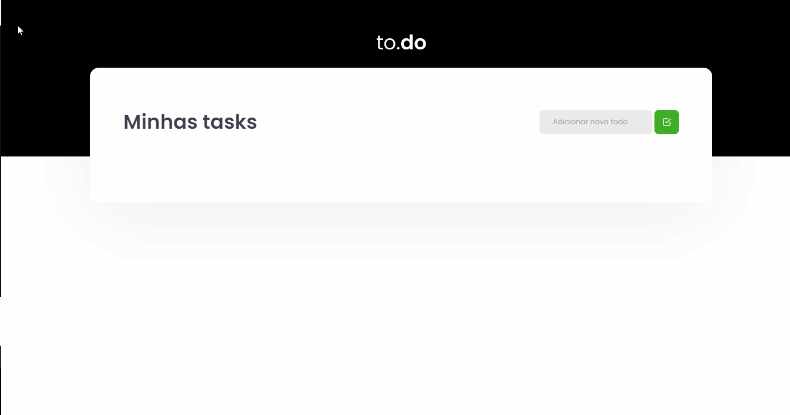

# Projeto to.doList

Simples projeto criado em ReactJS para usar diaramente para anotar pequenas tarefas de estudo.

Técnologias Utilizadas:

- React.js 

- SASS 

- TypeScript 

Demo

Projeto realizado durante a jornada Ignite da @rocketseat.
